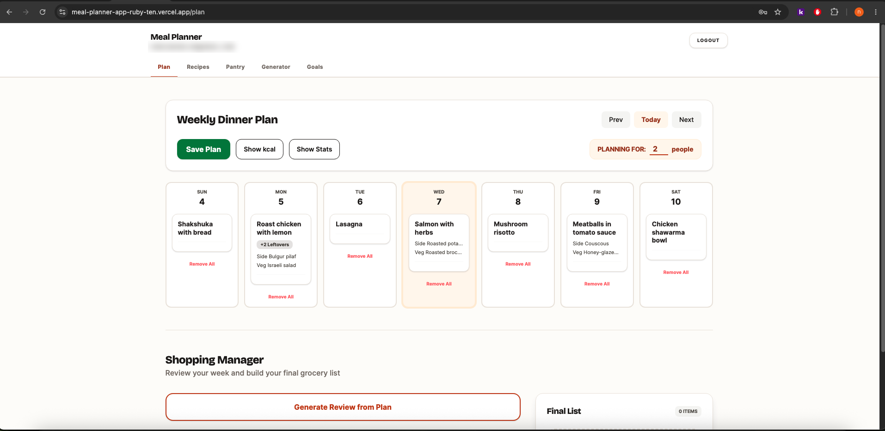

# Meal Planner

A weekly dinner planner that turns a plan into a shopping list. Pick recipes for each day, set nutrition goals, and get the aggregated ingredient list for the week — scaled to how many people you're cooking for.

**[Live app](https://meal-planner-app-ruby-ten.vercel.app)** · React + Supabase · 121 automated tests



## What it does

- **Weekly plan** — a main, side and vegetable side per day, with leftovers shown when a recipe makes more than you planned for
- **Recipes** — ingredients, instructions, photos, and per-serving nutrition calculated from the ingredient data
- **Pantry** — ingredients with nutrition pulled from the [Edamam](https://developer.edamam.com/) food database
- **Nutrition goals** — daily targets, with a weekly summary showing average calories, protein, fibre and fat against them
- **Shopping list** — totals every ingredient across the week. A recipe cooked twice is bought for twice, and amounts scale by the recipe's serving count
- **MCP server** — lets an AI assistant read the planner, so you can ask *"what recipes do I have?"* in Claude Desktop (see below)

## Stack

| | |
|---|---|
| Frontend | React 18, Vite 6, React Router 7, Tailwind CSS 4 |
| Backend | Supabase — Postgres, Auth, Storage, and realtime subscriptions |
| External data | Edamam food database for ingredient nutrition |
| Hosting | Vercel |

Colour, type and spacing are defined as design tokens in `@theme` (`src/index.css`) rather than as utility classes picked per component, so the palette is one system instead of twenty local decisions.

## How it's tested

Three suites, each covering what the others can't, all gating every pull request:

| Suite | Count | Tool | What it covers |
|---|---|---|---|
| Unit | 41 | Vitest | Shopping-list and nutrition arithmetic, week-date handling. Pure functions, extracted from components specifically so they could be tested without a database |
| End-to-end | 33 | Playwright (Python) | The real app against real Supabase — signing in, creating recipes, planning a week, building the list |
| Protocol | 47 | `node:test` | The MCP server, driven over JSON-RPC as a client would |

Two deliberate choices in there:

**Accessibility is a build gate, not a checklist.** `tests/tests/test_accessibility.py` runs axe-core against every route and fails CI on any WCAG 2.1 A/AA violation. When it was added it immediately caught 38 labels at 2.5:1 contrast where AA needs 4.5:1, two form fields whose visible `<label>` was never associated with its input, and seven identical unnamed `<select>` elements.

**The E2E suite signs in once.** It used to drive the login form in every test, which tripped Supabase's auth rate limit; now one session is captured and replayed, and the shared test account is cleaned at the *start* of each run so a crashed run is repaired by the next one rather than poisoning it.

## Running it

Requires Node 24 and a Supabase project.

```bash
npm install
cp .env.example .env    # then fill in the values below
npm run dev
```

`.env.example` lists every variable with a note on what reads it. The app needs the
Supabase pair plus two Edamam key pairs — one for the food database that backs
ingredient search, one for the nutrition analysis API.

```bash
npm test          # unit tests
npm run build     # production build
```

The Playwright suite additionally needs `TEST_USER_EMAIL` and `TEST_USER_PASSWORD` for a seeded Supabase account, and a dev server running:

```bash
pip install -r tests/requirements.txt
playwright install chromium
npm run dev &
pytest tests/ -v
```

> The E2E suite **deletes every row owned by `TEST_USER_*`** at the start of each run. Point it at a throwaway account, never your own.

## The MCP server

`mcp/` is a [Model Context Protocol](https://modelcontextprotocol.io) server — a separate Node package that exposes the planner to an AI assistant. Its own dependency tree, its own CI job.

Tools so far: `ping`, `list_recipes` (with an optional dish-type filter), and `add_ingredient`, which adds an ingredient to a recipe — creating it in the pantry first if it is new, and adding to the existing amount rather than listing it twice if the recipe already has it.

It signs in with a dedicated Supabase account using email and password, not a service-role key, so row-level security keeps applying and the server has exactly the access that one user has. Sign-in is deferred to the first tool call, so a credentials problem surfaces as a readable tool error instead of a server that dies before the client can ask why.

```bash
cd mcp
npm install
npm run check     # verifies credentials and prints your recipes
npm test
```

Add `MEAL_PLANNER_EMAIL` and `MEAL_PLANNER_PASSWORD` to the project's `.env` first. Use a different account from `TEST_USER_*` — the E2E suite wipes that one.

Claude Code picks the server up from `.mcp.json` automatically. For Claude Desktop, add to `claude_desktop_config.json`:

```json
{
  "mcpServers": {
    "meal-planner": {
      "command": "/absolute/path/to/node",
      "args": ["/absolute/path/to/meal-planner-app/mcp/server.js"]
    }
  }
}
```

Both paths must be absolute — Claude Desktop doesn't inherit your shell's `PATH`.

## Next

- `add_recipe` and `plan_meal` MCP tools, so a whole week can be built by conversation
- A shopping-list tool reusing `sumWeeklyIngredients`
- "Generate Review" currently builds its ingredient list from the on-screen plan including unsaved changes, so a refresh can leave shopping-list items for a recipe that was never saved. Fix is a dirty-state flag that requires saving first
